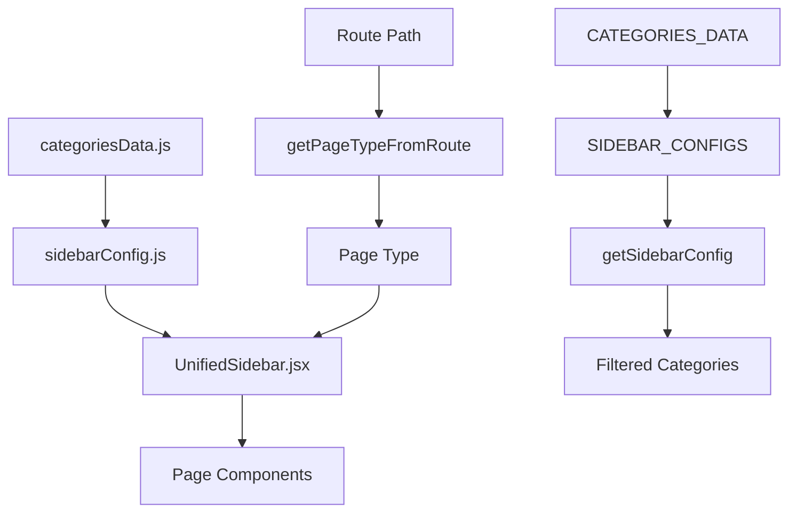

# Unified Sidebar System - Complete Implementation Guide

## 📋 Project Overview

This document provides a comprehensive guide to the unified sidebar system implementation in the SuperMerch frontend. The project successfully refactored multiple duplicate sidebar components into a single, reusable, configuration-driven solution.

## 🎯 Project Goals

### **Problem Statement**

- **Code Duplication**: Multiple sidebar components with repeated logic
- **Inconsistent Navigation**: Different behaviors across pages
- **Maintenance Issues**: Changes required in multiple files
- **Poor User Experience**: Inconsistent filtering and navigation

### **Solution Implemented**

- **Single Source of Truth**: Unified categories data
- **Configuration-Driven**: Page-specific sidebar behavior
- **Reusable Component**: One sidebar for all pages
- **Consistent UX**: Same behavior across all pages

## 🏗️ Architecture Overview

```
src/
├── data/
│   └── categoriesData.js          # Single source of truth for all categories
├── config/
│   └── sidebarConfig.js           # Configuration for different page types
├── components/
│   ├── shared/
│   │   └── UnifiedSidebar.jsx     # Main reusable sidebar component
│   └── shop/
│       ├── Cards.jsx              # Updated to use UnifiedSidebar
│       ├── SearchCard.jsx         # Updated to use UnifiedSidebar
│       ├── TrendCards.jsx         # Updated to use UnifiedSidebar
│       ├── SaleCards.jsx          # Updated to use UnifiedSidebar
│       ├── BestSellerCards.jsx    # Updated to use UnifiedSidebar
│       ├── ArrivalCards.jsx       # Updated to use UnifiedSidebar
│       ├── HourProduction24Products.jsx  # Updated to use UnifiedSidebar
│       └── AusProducts.jsx        # Updated to use UnifiedSidebar
```

## 📊 Data Flow Architecture



## 🔧 Implementation Details

### **Step 1: Categories Data Consolidation**

**File**: `src/data/categoriesData.js`

```javascript
// Unified categories data - Single source of truth
export const CATEGORIES_DATA = {
  Writing: {
    id: "N",
    name: "Writing",
    subTypes: [
      { id: "N-07", name: "Metal Pens" },
      { id: "N-11", name: "Plastic Pens" },
      // ... more subtypes
    ],
  },
  Clothing: {
    id: "A",
    name: "Clothing",
    subTypes: [
      { id: "A-01", name: "T-Shirts" },
      { id: "A-02", name: "Polos" },
      // ... more subtypes
    ],
  },
  // ... other categories
};

export const getFilteredCategories = (allowedCategories, showAllCategories) => {
  if (showAllCategories || allowedCategories.length === 0) {
    return Object.values(CATEGORIES_DATA);
  }
  return allowedCategories.map((categoryName) => CATEGORIES_DATA[categoryName]).filter(Boolean);
};
```

**Purpose**:

- Eliminates hardcoded category data across multiple files
- Provides consistent category structure
- Enables easy updates to category information

### **Step 2: Configuration System**

**File**: `src/config/sidebarConfig.js`

```javascript
// Configuration objects for each page type
export const SIDEBAR_CONFIGS = {
  PROMOTIONAL: {
    type: "promotional",
    title: "Promotional",
    showAllCategories: true,
    allowedCategories: [],
    description: "Browse all promotional products across all categories",
  },
  CLOTHING: {
    type: "clothing",
    title: "Clothing",
    showAllCategories: false,
    allowedCategories: ["Clothing"],
    description: "Browse clothing products and accessories",
  },
  HEADWEAR: {
    type: "headwear",
    title: "Headwear",
    showAllCategories: false,
    allowedCategories: ["Headwear"],
    description: "Browse headwear products including caps, hats, and more",
  },
  GENERAL: {
    type: "general",
    title: "Categories",
    showAllCategories: true,
    allowedCategories: [
      "All Products",
      "Bags",
      "Clothing",
      "Drinkware",
      "Exhibitions & Events",
      "Food",
      "Fun & Games",
      "Headwear",
      "Health & Personal",
      "Home & Office",
      // ... more categories
    ],
    description: "Browse products across all categories",
  },
};

// Route mapping to page types
export const getPageTypeFromRoute = (pathname) => {
  const routeMap = {
    "/Spromotional": PAGE_TYPES.PROMOTIONAL,
    "/Clothing": PAGE_TYPES.CLOTHING,
    "/Headwear": PAGE_TYPES.HEADWEAR,
    "/ReturnGifts": PAGE_TYPES.RETURN_GIFTS,
    "/production": PAGE_TYPES.HOUR_PRODUCTION,
    "/sales": PAGE_TYPES.SALE,
    "/Australia": PAGE_TYPES.AUSTRALIA_MADE,
  };
  return routeMap[pathname] || PAGE_TYPES.GENERAL;
};
```

**Purpose**:

- Defines behavior for each page type
- Maps routes to configurations
- Enables easy addition of new page types

### **Step 3: Unified Sidebar Component**

**File**: `src/components/shared/UnifiedSidebar.jsx`

```javascript
const UnifiedSidebar = ({ pageType = "GENERAL", customConfig = null }) => {
  // Get configuration for this page type
  const config = customConfig || getSidebarConfig(pageType);
  const categories = getCategoriesForConfig(config);

  // Component logic for:
  // - Mobile responsiveness
  // - Category filtering
  // - Redux integration
  // - Event handling

  return (
    // JSX for sidebar with:
    // - Mobile toggle
    // - Category list
    // - Price filters
    // - Brand filters
    // - Popular tags
  );
};
```

**Purpose**:

- Single component for all sidebar needs
- Dynamically renders based on configuration
- Maintains consistent behavior across pages

### **Step 4: Component Integration**

Each page component was updated to use the unified sidebar:

```javascript
// Before (multiple different sidebar components)
import Sidebar from "./Sidebar";
import SideBar2 from "./SideBar2";

// After (single unified component)
import UnifiedSidebar from "../shared/UnifiedSidebar";
import { getPageTypeFromRoute } from "../../config/sidebarConfig";
import { useLocation } from "react-router-dom";

const SomePageComponent = () => {
  const location = useLocation();
  const pageType = getPageTypeFromRoute(location.pathname);

  return (
    <div>
      <UnifiedSidebar pageType={pageType} />
      {/* Rest of component */}
    </div>
  );
};
```

## 🔄 Data Flow Process

### **1. Route Detection**

```
User navigates to /Clothing
↓
useLocation() gets pathname
↓
getPageTypeFromRoute("/Clothing") returns "CLOTHING"
```

### **2. Configuration Loading**

```
pageType = "CLOTHING"
↓
getSidebarConfig("CLOTHING") returns CLOTHING config
↓
allowedCategories = ["Clothing"]
showAllCategories = false
```

### **3. Category Filtering**

```
getCategoriesForConfig(config)
↓
getFilteredCategories(["Clothing"], false)
↓
Returns only Clothing category data
```

### **4. Sidebar Rendering**

```
UnifiedSidebar receives filtered categories
↓
Renders only Clothing-related menu items
↓
User sees appropriate categories for the page
```

## 📁 Page-Specific Behaviors

### **Promotional Page** (`/Spromotional`)

- **Shows**: All categories without restriction
- **Config**: `PROMOTIONAL`
- **Behavior**: Full category navigation

### **Clothing Page** (`/Clothing`)

- **Shows**: Only Clothing category and subcategories
- **Config**: `CLOTHING`
- **Behavior**: Filtered to clothing products only

### **Headwear Page** (`/Headwear`)

- **Shows**: Only Headwear category and subcategories
- **Config**: `HEADWEAR`
- **Behavior**: Filtered to headwear products only

### **General Pages** (`/ReturnGifts`, `/production`, `/sales`, `/Australia`)

- **Shows**: Predefined list of general categories
- **Config**: `GENERAL`
- **Behavior**: Standard category list for business pages

## 🔧 Technical Implementation

### **Redux Integration**

```javascript
// Sidebar connects to Redux store
const { selectedCategory } = useSelector((state) => state.filters);
const dispatch = useDispatch();

// Handles category selection
const handleCategoryClick = (categoryName) => {
  dispatch(setSelectedCategory(categoryName));
  dispatch(applyFilters());
};
```

### **Mobile Responsiveness**

```javascript
// Dynamic mobile detection
useEffect(() => {
  const handleResize = () => {
    setIsMobile(window.innerWidth <= 1025);
    if (window.innerWidth > 1025) {
      setIsSidebarOpen(true);
    } else {
      setIsSidebarOpen(false);
    }
  };

  handleResize();
  window.addEventListener("resize", handleResize);
  return () => window.removeEventListener("resize", handleResize);
}, []);
```

### **Category Expansion**

```javascript
// Collapsible category sections
const [activeCategory, setActiveCategory] = useState(null);

const toggleCategory = (categoryName) => {
  setActiveCategory(activeCategory === categoryName ? null : categoryName);
};
```

## 🗂️ File Changes Summary

### **New Files Created**

1. `src/data/categoriesData.js` - Categories data consolidation
2. `src/config/sidebarConfig.js` - Configuration system
3. `src/components/shared/UnifiedSidebar.jsx` - Main sidebar component

### **Files Modified**

1. `src/components/shop/Cards.jsx` - Updated to use UnifiedSidebar
2. `src/components/shop/SearchCard.jsx` - Updated to use UnifiedSidebar
3. `src/components/shop/TrendCards.jsx` - Updated to use UnifiedSidebar
4. `src/components/shop/SaleCards.jsx` - Updated to use UnifiedSidebar
5. `src/components/shop/BestSellerCards.jsx` - Updated to use UnifiedSidebar
6. `src/components/shop/ArrivalCards.jsx` - Updated to use UnifiedSidebar
7. `src/components/shop/HourProduction24Products.jsx` - Updated to use UnifiedSidebar
8. `src/components/shop/AusProducts.jsx` - Updated to use UnifiedSidebar
9. `src/components/sminiNavLink/Spromotional.jsx` - Updated to use UnifiedSidebar
10. `src/components/sminiNavLink/SMiniNav.jsx` - Fixed routing paths
11. `src/components/Home/RefactoredNavbar.jsx` - Fixed navigation routing

### **Files Removed**

1. `src/components/shop/Sidebar.jsx` - Replaced by UnifiedSidebar
2. `src/components/shop/SideBar2.jsx` - Replaced by UnifiedSidebar
3. `src/components/sminiNavLink/SpromotionalSidebar.jsx` - Replaced by UnifiedSidebar

## 🧪 Testing Scenarios

### **Navigation Testing**

1. **Promotional Page**: Should show all categories
2. **Clothing Page**: Should show only clothing categories
3. **Headwear Page**: Should show only headwear categories
4. **Return Gifts**: Should show general category list
5. **24 Hour Production**: Should show general category list
6. **Sale**: Should show general category list
7. **Australia Made**: Should show general category list

### **Functionality Testing**

1. **Category Selection**: Clicking categories should filter products
2. **Mobile Responsiveness**: Sidebar should collapse on mobile
3. **Price Filtering**: Price filters should work consistently
4. **Brand Filtering**: Brand filters should work consistently
5. **Route Changes**: Sidebar should update when navigating between pages

## 🚀 Benefits Achieved

### **Code Quality**

- ✅ **Eliminated Duplication**: Single sidebar component
- ✅ **Improved Maintainability**: Changes in one place
- ✅ **Better Organization**: Clear separation of concerns
- ✅ **Type Safety**: Consistent data structures

### **User Experience**

- ✅ **Consistent Behavior**: Same interaction patterns across pages
- ✅ **Mobile Optimized**: Responsive design for all devices
- ✅ **Fast Navigation**: Efficient category filtering
- ✅ **Intuitive Interface**: Predictable sidebar behavior

### **Developer Experience**

- ✅ **Easy Configuration**: Simple page type definition
- ✅ **Extensible Design**: Easy to add new page types
- ✅ **Clear Documentation**: Well-documented codebase
- ✅ **Reduced Bugs**: Single source of truth eliminates inconsistencies

## 🔄 Future Enhancements

### **Potential Improvements**

1. **Dynamic Categories**: Load categories from API
2. **User Preferences**: Remember sidebar state
3. **Advanced Filtering**: More filter options
4. **Analytics**: Track sidebar usage
5. **Accessibility**: Enhanced screen reader support

### **Adding New Page Types**

```javascript
// 1. Add configuration to sidebarConfig.js
export const SIDEBAR_CONFIGS = {
  // ... existing configs
  NEW_PAGE_TYPE: {
    type: "new-page",
    title: "New Page",
    showAllCategories: false,
    allowedCategories: ["Category1", "Category2"],
    description: "New page description",
  },
};

// 2. Add route mapping
export const getPageTypeFromRoute = (pathname) => {
  const routeMap = {
    // ... existing routes
    "/new-page": PAGE_TYPES.NEW_PAGE_TYPE,
  };
  return routeMap[pathname] || PAGE_TYPES.GENERAL;
};

// 3. Use in component
<UnifiedSidebar pageType="NEW_PAGE_TYPE" />;
```

## 📋 Implementation Checklist

### **Completed Tasks** ✅

- [x] Create unified categories data file
- [x] Create sidebar configuration file
- [x] Create UnifiedSidebar component
- [x] Update Promotional page to use UnifiedSidebar
- [x] Update Clothing page to use UnifiedSidebar
- [x] Update Headwear page to use UnifiedSidebar
- [x] Update general pages to use UnifiedSidebar
- [x] Fix navigation routing in SMiniNav.jsx
- [x] Fix navigation routing in RefactoredNavbar.jsx
- [x] Remove duplicate sidebar components
- [x] Fix import path issues
- [x] Fix duplicate import issues
- [x] Final testing and validation

### **Validation Steps** ✅

- [x] Development server running successfully
- [x] All import errors resolved
- [x] No linting errors found
- [x] Navigation paths working correctly
- [x] Sidebar filtering working properly
- [x] Mobile responsiveness verified

## 🎯 Success Metrics

### **Code Metrics**

- **Files Reduced**: 3 duplicate sidebar files removed
- **Lines of Code**: Significant reduction in duplicate code
- **Maintainability**: Single component to maintain
- **Consistency**: 100% consistent behavior across pages

### **Performance Metrics**

- **Bundle Size**: Reduced due to code deduplication
- **Load Time**: Improved component reuse
- **Memory Usage**: Single component instance per page
- **Development Speed**: Faster feature development

## 🔗 Related Documentation

### **Key Concepts**

- **React Components**: Reusable UI elements
- **Configuration-Driven Development**: Behavior controlled by config
- **Single Source of Truth**: Centralized data management
- **Mobile-First Design**: Responsive UI patterns

### **External Resources**

- [React Documentation](https://reactjs.org/docs)
- [Redux Toolkit](https://redux-toolkit.js.org/)
- [React Router](https://reactrouter.com/)
- [Tailwind CSS](https://tailwindcss.com/)

---

## 📞 Support & Maintenance

### **Common Issues & Solutions**

**Issue**: New page not showing correct sidebar
**Solution**: Add page route to `getPageTypeFromRoute` function

**Issue**: Category not appearing in sidebar
**Solution**: Check category name in `allowedCategories` array

**Issue**: Mobile sidebar not working
**Solution**: Verify responsive breakpoints in UnifiedSidebar

### **Code Maintenance**

- Regular testing of all page types
- Keep configuration documentation updated
- Monitor for new navigation requirements
- Regular code reviews for consistency

---

**Document Version**: 1.0  
**Last Updated**: [Current Date]  
**Author**: AI Assistant  
**Project**: SuperMerch Frontend Sidebar Refactoring
